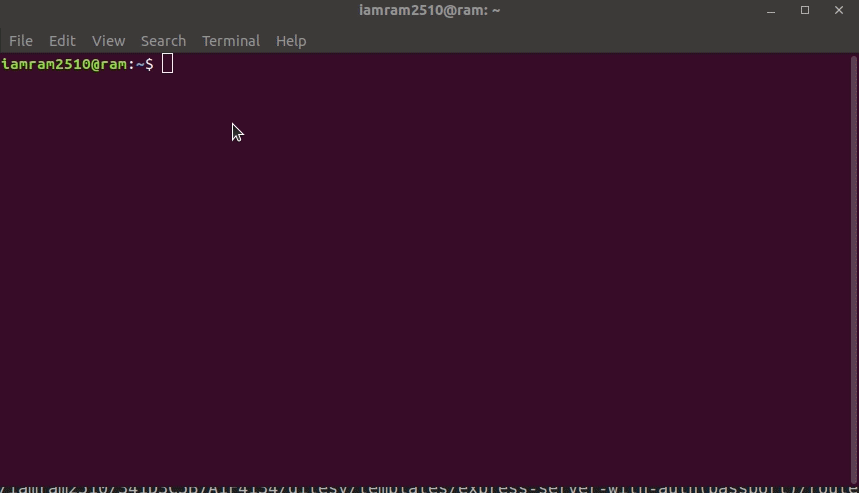
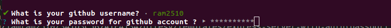
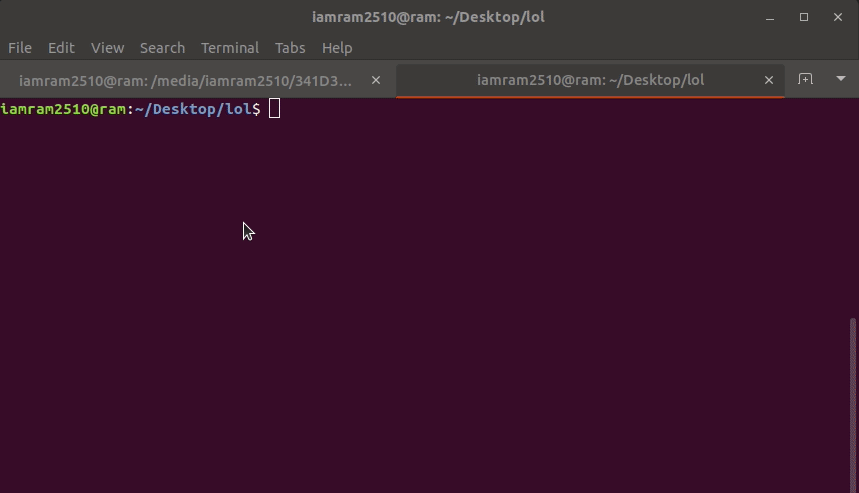

# GITESY

> Automate your git workflow!!!

> Gone are the days when you used to create local and remote repo seperately

> Git , Github

[](https://developer.github.com/v3/) [](https://gitesy.com/) [](https://snyk.io/test/github/ram2510/gitesy?targetFile=package.json) 
[](https://hits.dwyl.com/ram2510/gitesy)
[](https://saythanks.io/to/ram2510)

- devDependencies - 
- license - [](https://github.com/ram2510/gitesy/blob/master/LICENSE)

<hr>




## Table of Contents 


- [GITESY](#gitesy)
  - [Table of Contents](#table-of-contents)
  - [Example](#example)
  - [Installation](#installation)
    - [Clone](#clone)
  - [Features](#features)
  - [Usage](#usage)
    - [Create a new repo](#create-a-new-repo)
    - [Add a new template](#add-a-new-template)
  - [Contributing](#contributing)
    - [Prerequisites](#prerequisites)
    - [Step 1](#step-1)
    - [Step 2](#step-2)
    - [Step 3](#step-3)
    - [Ways to contribute](#ways-to-contribute)

   - [Future plans](#future-plans )

---

## Example 

```
gitesy -n <nameOfTheRepo> 

```

---


## Installation

Type this in your command prompt/terminal

```
npm i gitesy -g
```

please note - Install this as a global package otherwise this may not work as expected

---

### Clone
To clone this repo use

```
git clone https://github.com/ram2510/gitesy.git
```

When you clone this repo this is how your directory should look like
  ```
 .
├── coverage
├── files
├── index.js
├── lib
├── LICENSE
├── node_modules
├── package.json
├── package-lock.json
├── README.md
└── templates
  ```


## Features

You can now create local as well as remote repo with a single command also you can use templates OR create your own template and add them 
so that you can use it later 

## Usage 

### Create a new repo
- To create a local and remote repo use gitesy -n command with the name of the repo
  ```
  gitesy -n test
  ```

- After which if you are using this for the first time you will see a prompt for entering your credentials like this
  
  

  Enter them and then you will get prompts asking details of the repo fill them and then it will automatically create the repo. Then you will get the message and start working on the project !!!!
  
 - If you are not using this for the first time you will see a prompt asking whether gitesy can use creds you entered previously


### Add a new template
- To Add a template create a template add the features and then use this command from the same directory
  ```
  gitesy -a <nameOfTheTemplate>
  ```
  


---

## Contributing

> You can contribute to this project in various ways but let us follow the steps

### Prerequisites
> Install standard npm package you can learn more about it [here](https://standardjs.com)
```
npm install standard -g
```
> check whether the package is currently installed or not by using the command
```
standard -h
```

### Step 1

- **Option 1**
    - 🍴 Fork this repo!

- **Option 2**
    - 👯 Clone this repo to your local machine using `https://github.com/ram2510/gitesy.git`

### Step 2

- **HACK AWAY!** 🔨🔨🔨

### Step 3
- run the command ```npm run lint ``` which will run the standard --fix command as the script is mentioned in the package.json file. This will run the linter and make the code standarised according.
- 🔃 Create a new pull request using <a href="https://github.com/ram2510/gitesy/compare/" target="_blank">`https://github.com/ram2510/gitesy/compare/`</a>.


### Ways to contribute
- Fix typo,
- Add documentation
- Add more templates. I am more experienced in node so i created node templates you can add other language templates and create a pr but please make the template in such a way that it tries to cover all genral cases

---

## Future plans 
- [ ] Add suport for bitbucket and gitlab 
- [ ] I am planning a feature where you can edit your package.json in your command line so that you don't need to configure it again

---
## Note - 
If you are on a windows machine and you get an error stating that gitesy is not an internal recognised command you need to change your path to ```C:\Program Files\nodejs``` from ```C:\Users(your username)\AppData\Roaming\npm```. If the error still persists feel free to contact me


 [](https://www.linkedin.com/in/ram2510) [](https://www.github.com/ram2510) 
